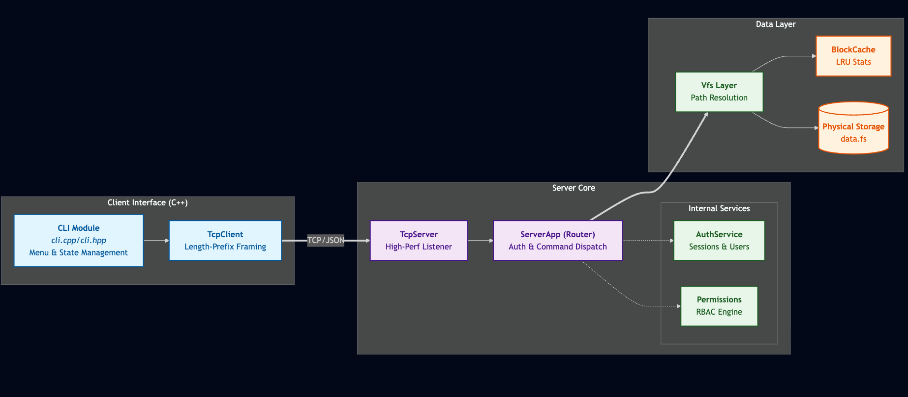
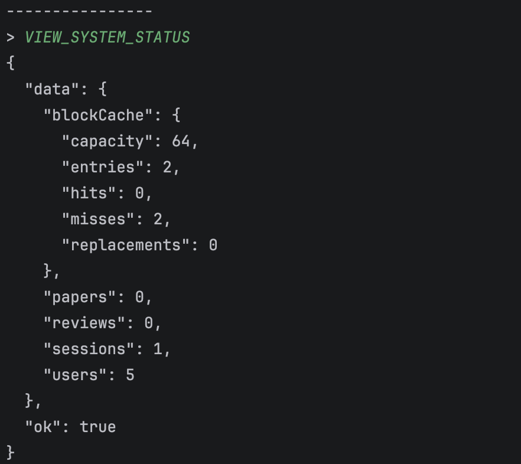
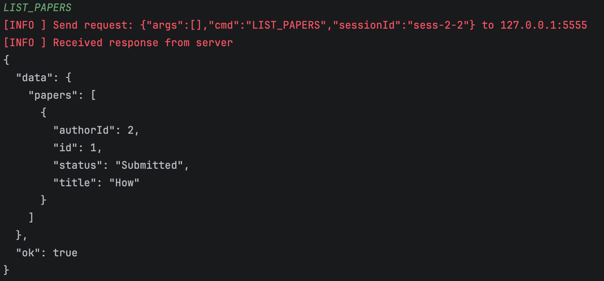
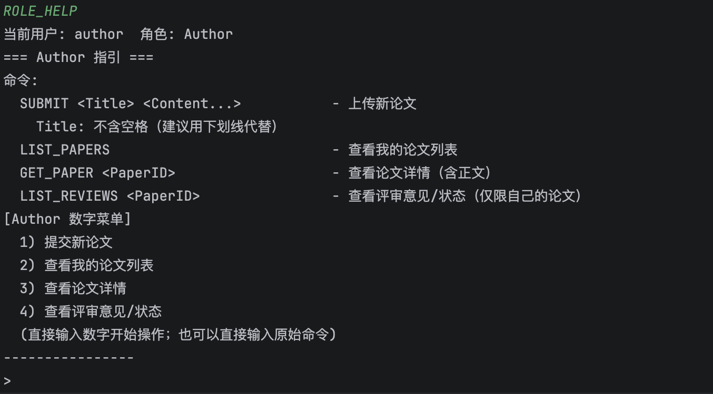
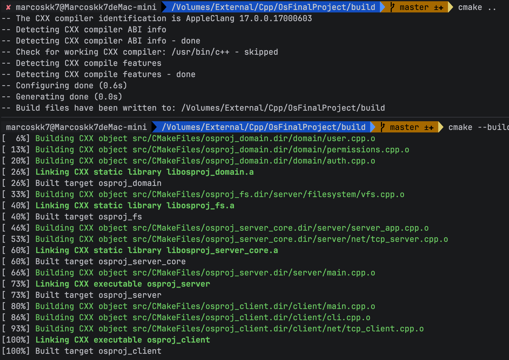
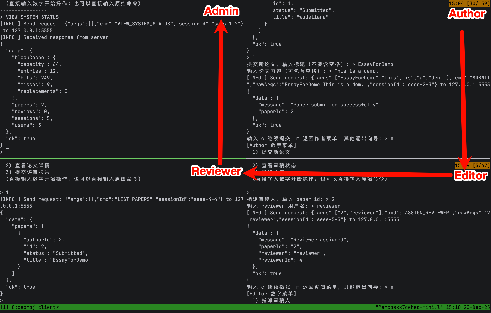

好的，我已经为您将报告翻译为正式的学术英语风格，同时严格保留了原始的图片路径和引用格式。

---

# Course Project Report: Simplified Academic Review System (SARS)

---

### 1. Project Background and Objectives

Modern academic conferences and journals rely heavily on online review systems, such as OpenReview and EasyChair. This course project aims to implement a "simplified yet comprehensive" review system to facilitate the understanding of core Operating System (OS) concepts, specifically:

*   **File System**: Superblock, inode table, data blocks, free bitmap, directory structure, and path resolution.
*   **Concurrent Access**: Server-side handling of simultaneous client requests.
*   **Caching**: Implementation of a configurable **LRU (Least Recently Used) block cache** with performance statistics (hits, misses, and replacements).
*   **Network Communication**: A Client-Server architecture utilizing a custom network protocol for all operations.
*   **Authentication and Access Control**: Login mechanisms, session management, and Role-Based Access Control (RBAC).

The system is developed using **C++17** and follows a Client-Server architecture. The client is a **Command Line Interface (CLI)**, while the server maintains a **custom Virtual File System (VFS)** that persists data—such as papers and reviews—into a backend file named `data.fs`.

---

### 2. Requirements Analysis — Alignment with Course Guidelines

The following key requirements from the course instructions have been addressed:

*   **C/S Architecture**: All operations are initiated by the client and executed by the server, which accesses the server-side file system. The server must support concurrent client access.
*   **Four User Roles**: Author, Reviewer, Editor, and Admin, each with distinct permissions and command sets.
*   **File System Implementation**: Must include a superblock, inode table, data blocks, and free bitmap. Support for multi-level directories, file creation, deletion, read/write operations, and path parsing is required.
*   **LRU Block Cache**: Configurable capacity with output for hit, miss, and replacement statistics.
*   **Backup and Recovery**: Support for creating, listing, and restoring backups, with optional extension to snapshot-based mechanisms.
*   **Protocol Design**: A clear, extensible protocol (textual or binary) for structured data exchange.

---

### 3. System Architecture Design

#### 3.1 Architecture Overview

The system consists of a CLI Client and a Server Application (`ServerApp`):

*   **Client (CLI)**: Parses user input, encapsulates commands into a unified JSON protocol, transmits requests via TCP, and renders the JSON responses. It automatically manages the `sessionId` after a successful login and maintains a "current directory" state for `LIST` operations.
*   **Server (ServerApp)**: Listens for messages, parses commands, validates sessions, performs permission checks, and invokes the `Vfs` module for data persistence, returning a unified response structure.

#### 3.2 Software Module Decomposition

The project is organized into the following modules within the `src/` directory:

*   **`src/common/`**: Shared types and protocol definitions.
    *   `types.hpp`: Fundamental types such as `UserId`, `PaperId`, `Role`, and `Credentials`.
    *   `protocol.hpp`: Message envelopes, the unified `Command` structure, serialization/deserialization, and response construction.
*   **`src/domain/`**: Domain models, permissions, and authentication.
    *   `auth.hpp/.cpp`: In-memory user registry and session management (educational implementation).
    *   `permissions.hpp/.cpp`: Permission matrix mapping roles to authorized actions.
    *   `paper.hpp` / `review.hpp` / `user.hpp`: Domain object definitions.
*   **`src/server/`**: Server-side implementation.
    *   `server_app.hpp/.cpp`: Command routing, authentication, permission validation, and business logic.
    *   `filesystem/`: VFS implementation including superblock, inodes, bitmaps, directories, path parsing, and the LRU cache.
    *   `net/`: TCP server utilizing length-prefixed JSON framing.
*   **`src/client/`**: Client-side implementation.
    *   `cli.hpp/.cpp`: Interactive CLI featuring role-specific menu wizards.
    *   `net/`: TCP client responsible for request-response cycles.

---

### 4. Communication Protocol: Extensible JSON Envelope and Command

#### 4.1 Message Envelope

Communication messages consist of a `MessageType` and a JSON `payload`, serialized into a JSON string:

*   `type`: `"CommandRequest" | "CommandResponse" | "Error" | ...`
*   `payload`: A JSON object containing specific request or response data.

The transport layer employs **4-byte network-order length-prefix framing** followed by **N bytes of JSON data** to prevent packet fragmentation and coalescing issues.

#### 4.2 Unified Command Structure

The `payload` utilizes a standardized command structure:

*   `cmd`: Command identifier (e.g., `PING`, `LOGIN`, `LIST_PAPERS`).
*   `args`: Array of space-delimited parameters.
*   `rawArgs`: Original parameter string, used for commands like `WRITE` or `REVIEW` that require preservation of whitespace.
*   `sessionId`: Carried after login to facilitate stateless authentication.

---

### 5. Virtual File System (VFS) Design

#### 5.1 Disk Layout: `data.fs`

The server mounts `data.fs` upon startup. If the file is missing or the magic number is invalid, the system undergoes an automatic format. The current implementation uses a fixed layout:

*   **Block Size**: 4096 bytes
*   **Total Capacity**: 1024 blocks
*   **Superblock**: Block 0
*   **Inode Table**: Fixed allocation (currently 8 blocks)
*   **Free Bitmap**: 1 block for data block management
*   **Data Blocks**: Remaining blocks

#### 5.2 Inode and Data Block Management

*   **Inode Metadata**: Each inode records an `id`, type (file/directory), size, and a set of **direct blocks**.
*   **Allocation**: Data blocks are managed via the **free bitmap** using a "first-fit" scan.
*   **I/O**: Block access is performed via `readBlock/writeBlock` at specific offsets within `data.fs`.

#### 5.3 Directory Structure and Path Resolution

*   **Multi-level Path Resolution**: The system decomposes paths (e.g., `/a/b/c`) into components and traverses directory entries to locate target inodes.
*   **Directory Entry (DirEntry)**: A fixed-length structure containing `inodeId` and `name[60]`.
*   **Operations**: Supports `MKDIR`, `LIST`, file/directory creation and deletion (directory must be empty for removal).

#### 5.4 LRU Block Cache: Configuration and Statistics

The `BlockCache` is an in-memory LRU cache:

*   **Capacity**: Configurable via server startup arguments or the `OSP_CACHE_CAPACITY` environment variable.
*   **Monitoring**: Tracks `hits`, `misses`, `replacements`, and `entries`.
*   **Status Reporting**: The `VIEW_SYSTEM_STATUS` command returns cache statistics for performance evaluation.

---

### 6. Authentication and Access Control

#### 6.1 Session Management

The `AuthService` maintains:

*   `usersByName_`: A mapping of usernames to user information.
*   `sessionsById_`: A mapping of session IDs to session data. Sessions follow the format `sess-<uid>-<counter>`.

#### 6.2 Role-Based Access Control (RBAC)

The `Permission` abstraction defines high-level actions (e.g., uploading papers, assigning reviewers). A role-based matrix determines whether a user can execute a specific command. Permission checks are centralized in the server’s command router.

---

### 7. Business Logic and Persistence: Academic Review Flow

#### 7.1 VFS Data Structure Conventions

All review-related data is persisted within the VFS:

*   `/papers/<id>/meta.txt`: Metadata (Author ID, status, title).
*   `/papers/<id>/content.txt`: Paper body.
*   `/papers/<id>/reviewers.txt`: List of assigned reviewer IDs.
*   `/papers/<id>/reviews/<reviewerId>.txt`: Review content (decision and comments).

#### 7.2 Key Role-Based Commands

*   **Author**: `SUBMIT`, `LIST_PAPERS` (personal), `GET_PAPER`, `LIST_REVIEWS`.
*   **Reviewer**: `LIST_PAPERS` (assigned only), `REVIEW` (submit decision).
*   **Editor**: `ASSIGN_REVIEWER`, `MAKE_FINAL_DECISION` (updates status in `meta.txt`).
*   **Admin**: `MANAGE_USERS`, `VIEW_SYSTEM_STATUS` (cache and system metrics), `BACKUP/RESTORE`.

---

### 8. Current Progress Summary

#### 8.1 Implemented Features
*   **Core Communication**: TCP with length-prefix framing and JSON serialization.
*   **Protocol**: Unified `CommandRequest/Response` framework.
*   **Authentication**: Session-based login and validation.
*   **Access Control**: RBAC matrix enforcement at the server level.
*   **VFS Core**: Superblock, inode table, bitmap, and block-level I/O.
*   **Path Logic**: Multi-level path resolution and directory CRUD operations.
*   **LRU Cache**: Configurable capacity and performance monitoring.
*   **Business Flow**: End-to-end review process (Submission → Assignment → Review → Decision).

#### 8.2 Partial Implementation
*   **Directory Limits**: Single-block directory limit (entries constrained by block size).
*   **File Limits**: Direct blocks only; no support for indirect blocks or large file indexing.

#### 8.3 Pending Features
*   **Concurrency**: The current TCP server utilizes a synchronous model; multi-threaded/concurrent request handling is pending.
*   **Backup Persistence**: While the interface and permissions are ready, the logic for file snapshots and restoration needs to be finalized.

---

### 9. Build and Execution

#### 9.1 Build Process
The project uses CMake. Binaries are generated in the `build/` directory:
*   `osproj_server`
*   `osproj_client`

#### 9.2 Execution
*   **Server**: `./build/src/osproj_server [port] [cacheCapacity]`
*   **Client**: `./build/src/osproj_client` (Connects to 127.0.0.1:5555 by default).

---

### 10. Future Work

1.  **Concurrency Refactoring**: Transition the `TcpServer` to a multi-threaded architecture (e.g., thread-per-connection or thread pool) with mutex protection for VFS and Auth resources.
2.  **Backup Logic**: Implement full-file copy snapshots for `data.fs`.
3.  **VFS Enhancements**: Support for multi-block directories, indirect blocks for larger files, and persistence for the user table.

---

### 11. Testing and Verification

*   **Protocol Integrity**: Verified via malformed JSON and missing field tests.
*   **Permission Boundaries**: Confirmed that Authors cannot access Admin panels and Reviewers cannot access unassigned papers.
*   **Cache Statistics**: Validated that repeated reads increase the hit rate in `VIEW_SYSTEM_STATUS`.

---

### 12. Team Division

*   **Wang Ziheng**: Overall architecture, protocol design, server command routing, and VFS implementation (superblock, inode, bitmap, directory, and cache).
*   **Song Xi**: Front-end system architecture and visual interaction implementation, including UI design, dynamic file tree rendering, and communication encapsulation.
*   **Zhang Yehan & Li Yutong**: CLI implementation, business logic for four roles, permission matrix, and backup/restore framework.

---

### 13. Appendix: Command Quick Reference

*   **Basic**: `PING`, `LOGIN`, `ROLE_HELP`
*   **File System**: `LIST`, `MKDIR`, `WRITE`, `READ`, `RM`, `RMDIR`, `CD`
*   **Review Flow**: `SUBMIT`, `LIST_PAPERS`, `GET_PAPER`, `ASSIGN_REVIEWER`, `REVIEW`, `VIEW_REVIEW_STATUS`, `MAKE_FINAL_DECISION`
*   **Management**: `MANAGE_USERS`, `BACKUP`, `RESTORE`, `VIEW_SYSTEM_STATUS`