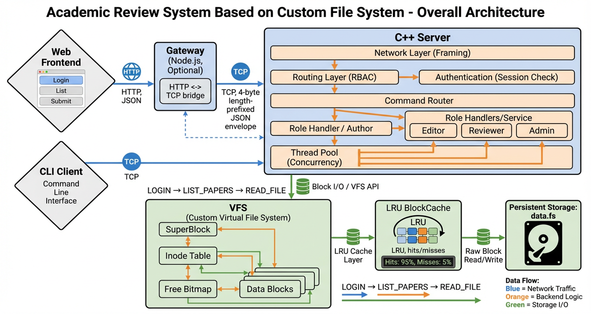
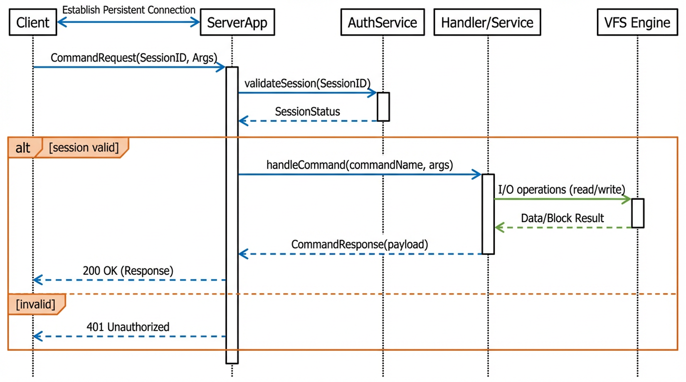
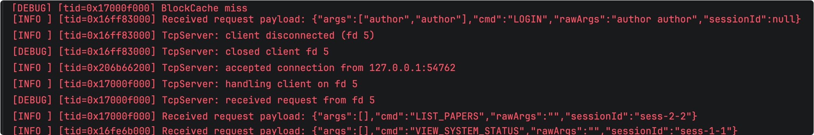
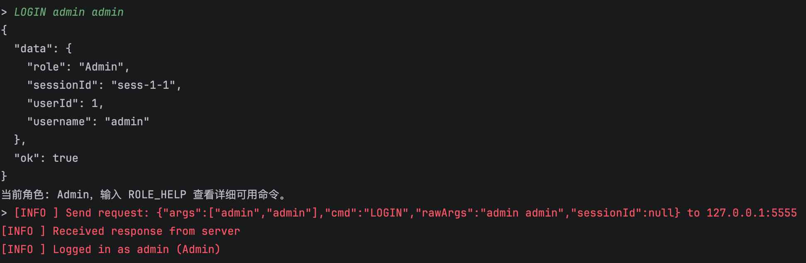
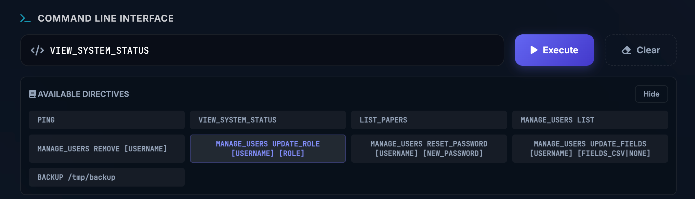
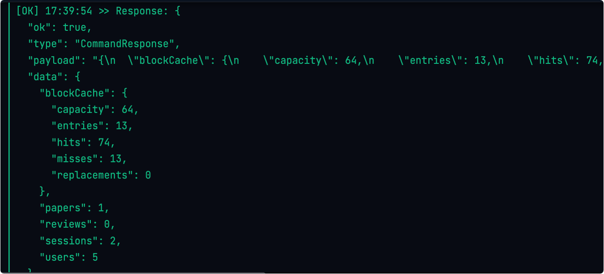

# Operating Systems Course Project Report: Simplified Academic Peer-Review System

---

### 1. Introduction

#### 1.1 Project Background and Objectives
Online peer-review systems, such as OpenReview and EasyChair, are widely used in modern academic conferences and journals. This course project aims to facilitate a deeper understanding of core operating system concepts by implementing a simplified yet functionally complete peer-review system. The project focuses on file systems, concurrency control, caching mechanisms, network communication, and authentication/permissions.

This project is developed using the C++17 standard. The client features a command-line interface (CLI), while the server maintains a custom Virtual File System (VFS), persistently storing all business data in a backend file named `data.fs`.

#### 1.2 Requirements Analysis
According to the course guidelines, the system must meet several key technical specifications and business requirements. The system adopts a **C/S Architecture** where all business operations are initiated by the client, and the server parses requests and operates on the file system, supporting multiple concurrent client connections.

The **Role System** supports four roles: Author, Reviewer, Editor, and Admin, each with independent command sets and permissions.

The **Core File System** implements a block device abstraction, managing the superblock, inode table, data blocks, and free bitmap. It supports multi-level directory and path resolution, as well as file creation, reading, writing, and deletion.

For **Cache Optimization**, the system introduces an LRU algorithm-managed block cache with configurable capacity, capable of real-time output of cache hit rates and replacement statistics.

The system also supports **Data Backup** with full backup and recovery mechanisms to ensure data security.

Finally, the **Communication Protocol** is designed to be clear and extensible, supporting the transmission of both text and binary data.

---

### 2. Implementation Details

#### 2.1 System Architecture
The system adopts a classic Client-Server architecture. The client is responsible for parsing user commands and encapsulating them into protocol messages; the server handles business logic processing, permission verification, and underlying file system operations.



As shown in the figure, the core system components include the **Client CLI** (a command-line interaction terminal responsible for user input parsing and result display), **TCP Network** (a communication link based on the TCP protocol ensuring reliable data transmission), **Server Application** (the main server program containing request routing and business logic), **VFS** (the Virtual File System layer shielding underlying storage details), and **Data Persistence** (where final data is stored in binary form in the host machine's `data.fs` file).

#### 2.2 Module Partitioning and Class Design
To achieve high cohesion and low coupling, the project adopts a clear modular structure. The following figure shows the main system classes and their relationships:



The responsibilities of the main modules are as follows. **Common** defines basic types, logging tools, and application-layer protocol structures. **Domain** contains domain models related to user authentication, permission matrices, and paper review. **Server/Net** implements network communication based on the `TcpServer` class, internally integrating a `ThreadPool` to support concurrent processing. **Server/Filesystem** handles the core file system implementation, including `SuperBlock`, `Inode`, `BlockCache`, and `Vfs` management classes. **Client** encapsulates `TcpClient` communication logic and `Cli` interaction logic.

#### 2.3 Concurrency Model
To meet the requirement for concurrent access by multiple clients, the server employs a Reactor pattern combined with a thread pool concurrency model.



The main thread is responsible for listening to ports and accepting new connections. Once a connection is established, the socket descriptor obtained via `accept` is dispatched to a worker thread in the `ThreadPool`. The worker thread is responsible for all subsequent read/write requests and business processing for that connection, achieving connection-level concurrency control. By introducing `std::mutex` mutual exclusion locks, the safety of shared data in VFS and authentication services is ensured in a multi-threaded environment.

#### 2.4 Communication Protocol Design
The system defines a custom application-layer communication protocol where the message structure includes a type identifier and payload data. All messages are serialized into JSON format strings for transmission.

The **Type** identifies the message type, such as `CommandRequest`, `CommandResponse`, or `Error`. The **Payload** carries specific request parameters or response data. The transport layer uses a **Framing** mechanism with a "4-byte length prefix + message body" format to effectively resolve TCP sticky packet issues.



#### 2.5 Custom File System Design
Upon startup, the server mounts or formats the `data.fs` file. The file system adopts a classic Unix file system layout, divided into the superblock, inode table, free bitmap, and data block area.


The **Disk Layout** consists of the **Superblock** (storing file system metadata like magic number, block size, and total block count), **Inode Table** (storing file metadata like type, size, and direct block indices), **Free Bitmap** (managing data block allocation using a bitmap), and **Data Blocks** (storing file content or directory entries).

For **Directory and Path Resolution**, directories are implemented as files storing `DirEntry` structures. The system supports full multi-level path resolution, capable of resolving paths like `/papers/1/content.txt` to their corresponding Inodes.

The **Caching Mechanism** integrates a `BlockCache` module implementing an LRU cache algorithm based on memory. The system provides statistical interfaces to view cache hits and replacements in real-time.

#### 2.6 Authentication and Access Control
**User Authentication** is handled via `AuthService`. After login, a `sessionId` is generated, which the client automatically carries in subsequent requests for identity verification.

**Access Control** is based on the RBAC model. The `Permission` module defines a permission matrix, and the server verifies operation permissions based on the session role (Author, Reviewer, Editor, or Admin).


#### 2.7 Business Process and Interaction
The system maps paper review business logic to file system operations. To **Submit Paper**, a directory is created in `/papers/` and metadata is written. To **Assign Reviewer**, the Editor modifies `reviewers.txt`. To **Submit Review**, the Reviewer writes review files in the `reviews/` directory. For the **Final Decision**, the Editor updates the metadata status.

**Client Interaction** is facilitated by the CLI, which provides dynamic menus and shortcut commands.



---

### 3. Execution Instruction

#### 3.1 System Build
The project uses CMake for build management.

1. **Environment Requirements**: C++17 Compiler (GCC/Clang), CMake 3.10+
2. **Build Commands**:
   ```bash
   mkdir build && cd build
   cmake ..
   cmake --build .
   ```
3. **Artifacts**:
   - `build/src/osproj_server`: Server executable
   - `build/src/osproj_client`: Client executable

#### 3.2 Running Instructions
1. **Start Server**:
   ```bash
   ./build/src/osproj_server [port] [cacheCapacity]
   # Example: ./build/src/osproj_server 8080 1024
   ```
2. **Start Client**:
   ```bash
   ./build/src/osproj_client [serverIp] [serverPort]
   # Example: ./build/src/osproj_client 127.0.0.1 8080
   ```

---

### 4. Result Presentation

#### 4.1 Completed Functionality Checklist
- [x] **Basic Communication**: TCP network communication and JSON protocol encapsulation.
- [x] **Concurrent Service**: Thread pool concurrency processing model.
- [x] **File System**: Superblock, Inode, Bitmap, and file CRUD operations.
- [x] **Path Resolution**: Multi-level directory support.
- [x] **Cache System**: LRU cache and statistics.
- [x] **Business Logic**: Full process for paper submission, assignment, review, and decision.
- [x] **Permission Control**: Role-based permission verification.

#### 4.2 System Operation Demonstration
The figure below shows the end-to-end operation of the system in a multi-terminal environment, verifying multi-role collaboration and data persistence.



---

### 5. Team Division

- **Wang Ziheng**: Responsible for overall architecture design, protocol formulation, server core routing, and custom file system (Superblock, Inode, Bitmap) implementation.
- **Song Xi**: Responsible for frontend system architecture design, visualization interaction implementation, and frontend-backend communication module encapsulation.
- **Zhang Yehan & Li Yutong**: Responsible for Client CLI development, business process logic implementation, permission matrix design, and backup/recovery function research.

---

### 6. Appendix

**Core Command Reference**:
- **System Commands**: `PING`, `LOGIN`, `ROLE_HELP`, `VIEW_SYSTEM_STATUS`
- **File Operations**: `LIST`, `MKDIR`, `WRITE`, `READ`, `RM`
- **Business Operations**: `SUBMIT`, `ASSIGN`, `REVIEW`, `DECISION`
